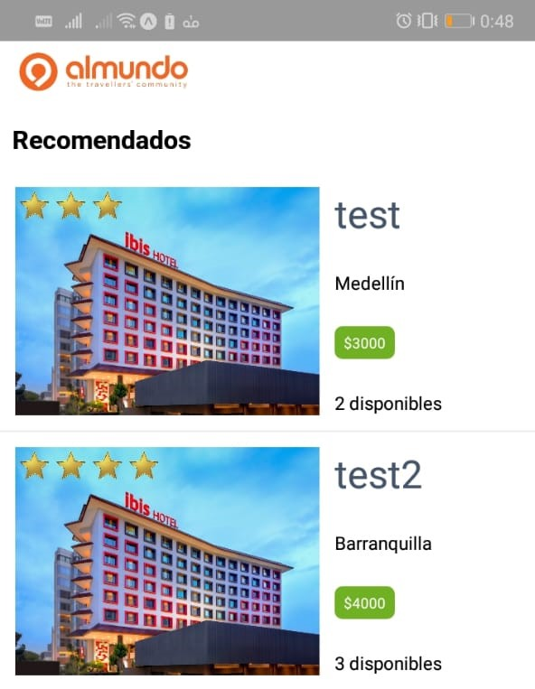
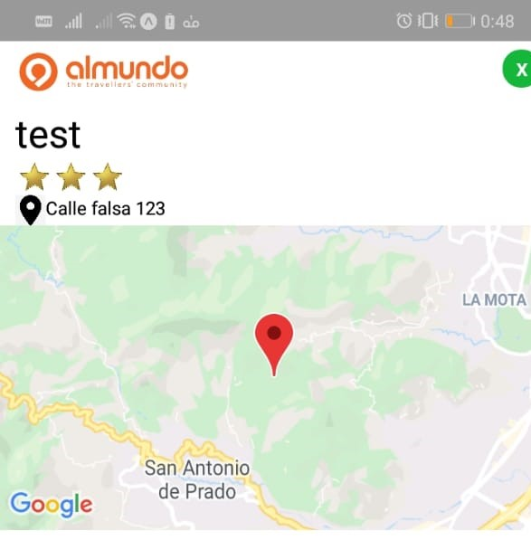

# Almundo APP

Aplicación dedicada a la búsqueda de **Hoteles**, obteniendo información de cada uno, como: Descripción, Disponibilidad y Ubicación.

>### Aplicación en la nube: [Heroku Almundo API](https://almundo-ponton.herokuapp.com)

## Instalar y correr
Use estos comandos para el despliegue local:
- `npm install`
- `npm run start`

### Dependencias:
	"dependencies": {
	  "cookie-parser": "~1.4.4",
	  "cors": "^2.8.5",
	  "debug": "~2.6.9",
	  "express": "~4.16.1",
	  "http-errors": "~1.6.3",
	  "jade": "~1.11.0",
	  "mongoose": "^5.8.7",
	  "morgan": "~1.9.1"
	} 
	
### Hoteles:

> en [Heroku Almundo API / hoteles](https://almundo-ponton.herokuapp.com/hotels)

### Información Hotel:

> en [Heroku Almundo API / id_hotel](https://almundo-ponton.herokuapp.com/hotels/5e2221848a3f4f6f8ced8277), id de ejemplo: **5e2221848a3f4f6f8ced8277**

## Authors

- **Carlos Pontón**  -  _Prueba Almundo_  -  [carlosponton](https://github.com/carlosponton)
